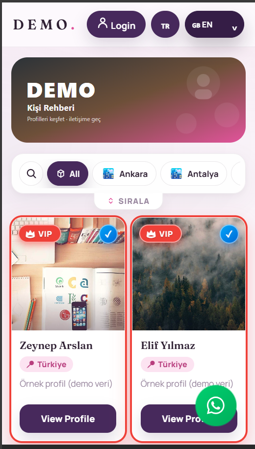
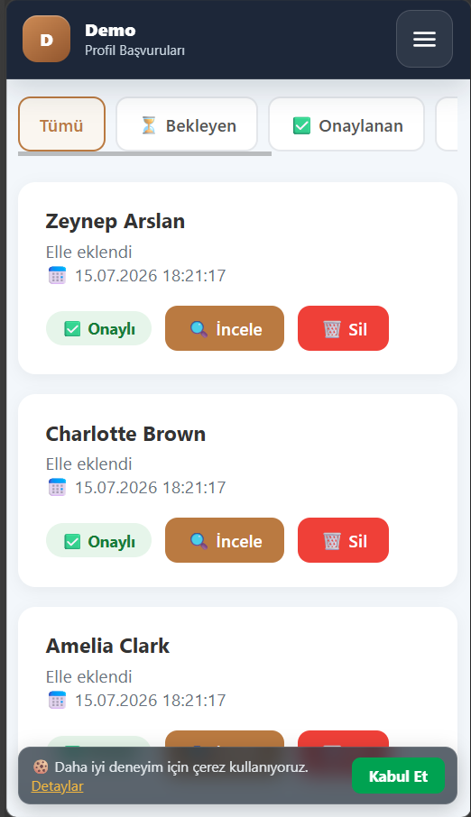
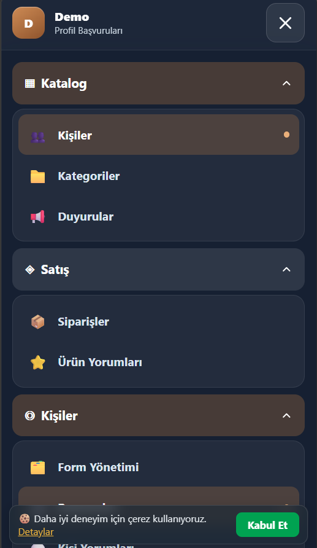
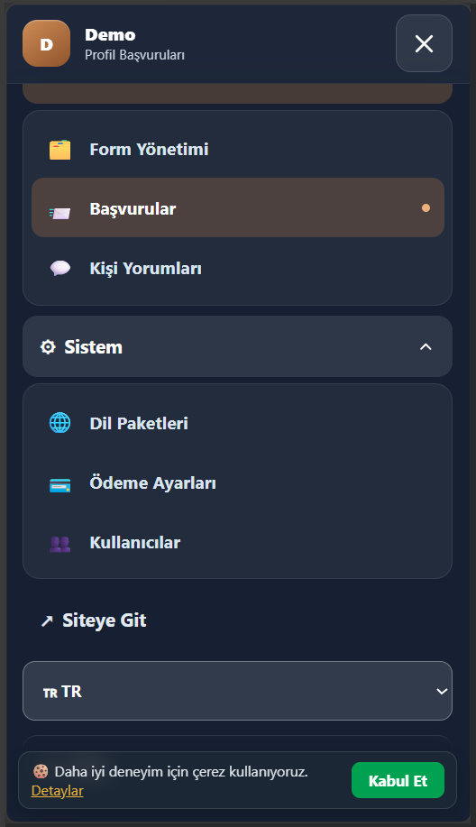
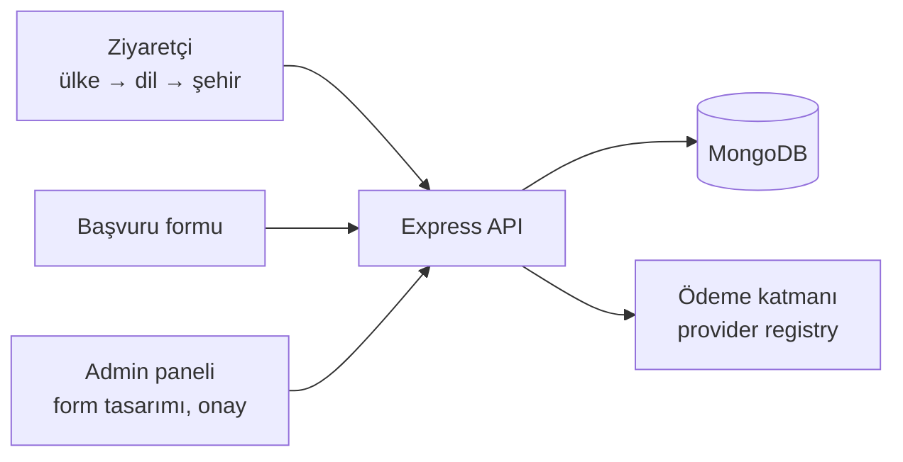

# Profil Rehberi Platformu

**Çok ülkeli profil/ilan rehberi.** Kullanıcılar başvuru formuyla profil oluşturur, admin onaylar, ziyaretçiler ülke ve şehre göre profilleri görür. Öne çıkarma paketleri ücretli olarak satılır.

> Kaynak kod private. Bu depo projenin tanıtım sayfasıdır. İstek üzerine demo yapılabilir.

<table>
  <tr>
    <td align="center"> Ziyaretçi: profil listesi</td>
    <td align="center"> Admin: başvurular</td>
    <td align="center"> Admin menüsü</td>
    <td align="center"> Sistem ayarları</td>
  </tr>
</table>

## Özellikler

**Ziyaretçi**
- İlk girişte ülke seçimi; site dili ülkeye göre otomatik ayarlanır (i18n)
- Sadece yayında profili olan şehirleri gösteren şehir filtresi
- Profil detayı, WhatsApp/Telegram iletişim, yorumlar
- VIP / PRO / Öne Çıkan rozetleri

**Başvuru ve onay**
- Admin panelinden alanları tasarlanan **dinamik başvuru formu** (sekmeli)
- Formdaki alanların profil kartına nasıl yansıyacağı panelden eşlenir
- Başvuruları onaylama, düzenleme, yorum moderasyonu

**Ödeme**
- Sağlayıcıdan bağımsız ödeme katmanı: ortak arayüz ve sağlayıcı kayıt yapısı
- Birden fazla sağlayıcı adaptörü (kart, kripto, ön ödemeli kart) ve test için sahte sağlayıcı
- Öne çıkarma paketi siparişleri, panelden yönetilen ödeme ayarları

**Yönetim**
- Ülke, kategori, dil ve duyuru yönetimi (veritabanı tabanlı)
- 2FA'lı admin girişi; JWT, Helmet, rate limiting, girdi doğrulama

## Mimari

## Teknolojiler

Node.js · Express · MongoDB / Mongoose · JWT · Helmet · i18n · HTML/CSS/JavaScript
